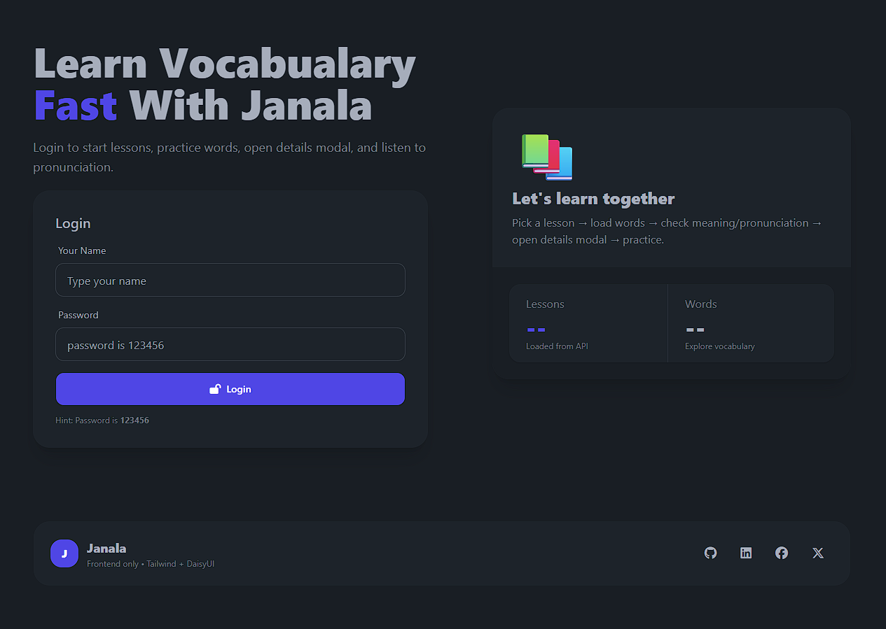

# Janala - Vocabulary Learning App

A simple vocabulary learning web app using HTML, TailwindCSS, DaisyUI and JavaScript.

## Features

- Login system
- Dynamic lesson loading
- Vocabulary cards
- Word pronunciation
- Word details modal
- Responsive UI

## Technologies

- HTML
- Tailwind CSS
- DaisyUI
- JavaScript
- SweetAlert2
- Font Awesome

## API Used

Programming Hero Open API

## Screenshot

